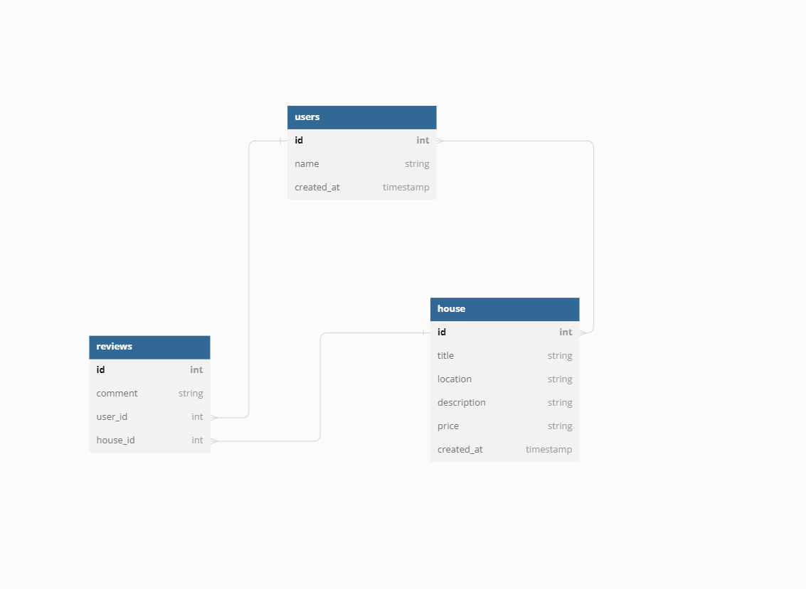

# Name of the Project
House Hunt App
### Author : Name Date
Catherine Renee Mumbi 03/03/2023
## Project Description
This project is a single page application that displays to the user a list of all the available houses that are up for rent on the website.The user is able to view more details about the houses such as the description of the house as well as the price by clicking on the view more button.  The project incorporates a form that enables you to add a new house that is available for rent. It also displays previous reviews that have been left for the house in particular.

## Project SetUp 
1. Clone the repository ( there are 2 repositories, one for the back end and one for the front end respectively)

https://github.com/ray-nay/phase-3-sinatra-react-project : This repository has all the starter code needed to get a Sinatra backend up and running.

https://github.com/ray-nay/my-app-front-end

2. Install dependencies
bundle install
npm install

3. Start the development server

bundle exec rake server - This will run your server on port http://localhost:9292.
npm start - This will run your server on port http://localhost:3000.

4. Open your browser and navigate to http://localhost:3000 to view the app.

To view the houses click on the Home button on the navbar to view all the available houses for rent.

To view more details about a particular house, click on the View More button which will show you the description of the house as well as the price. To exit this page, click on the Back button which will take you back to the home page.

To add a new house, click on the Add House button on the navbar and insert all the necessary details required on the form then press submit. It will alert you that the house has been added successfully. Navigate to the end of the list to see your added house.

******

## Technologies Used
1.ReactJS
2.React Router
3.Babel
4.ESlint
5.Node.js
6.Ruby
7.Sweet alert
8.Postman
9.Dbdiagram.io
10.Sinatra
*****

### Landing page 
This is the landing page.

### Form page that is used to submit a new house.
This is the page that holds the form used to submit a new house.

### House display page
This is the page that displays the house description, as well as the price after the user has clicked on the View More.

### ERD

## Contact Information
* 1723renee@gmail.com
*****